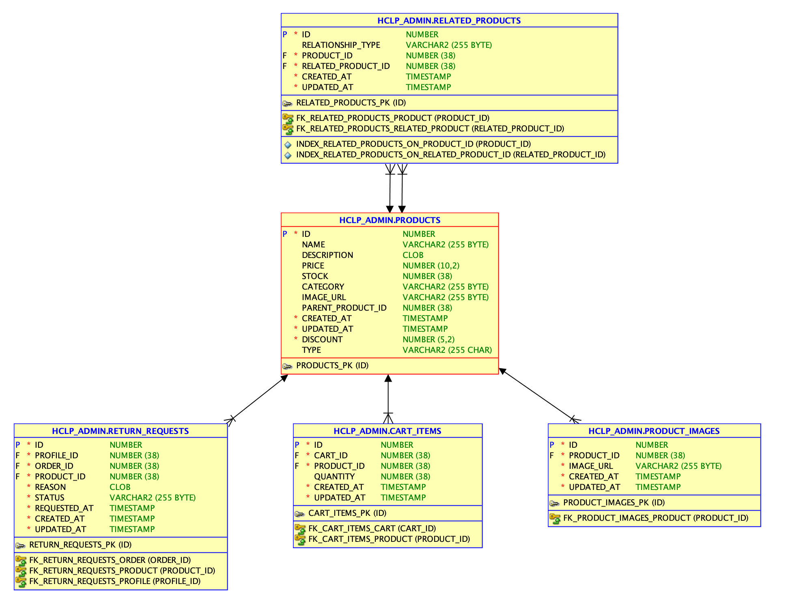
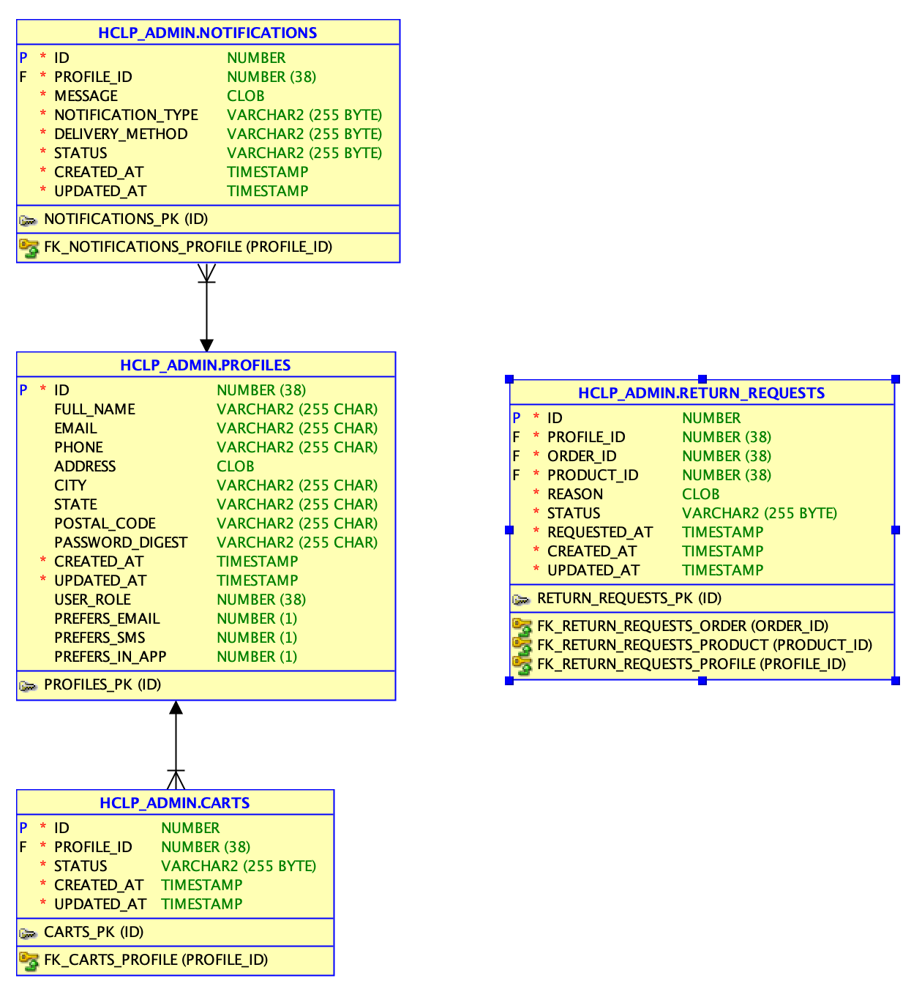

# Extensión del Modelo eCommerce: Clases Derivadas para `Product` y `Profile`

En esta fase, hemos implementado clases derivadas de las entidades `Product` y `Profile` para manejar diferencias específicas entre distintos tipos de productos y usuarios en la plataforma eCommerce.

## Modelo

**Products**


**Profiles**



## Clases Derivadas de Product

Para extender la clase `Product`, hemos utilizado el patrón **Single Table Inheritance (STI)** en Rails, lo que nos permite definir subclases `DigitalProduct` y `PhysicalProduct` dentro de una misma tabla (`products`). Esto facilita la gestión de los diferentes tipos de productos sin duplicar tablas.

### Implementación

1. **Campo `type` en `products`**: Rails utiliza el campo `type` para identificar la clase específica de cada registro dentro de una misma tabla en el caso de STI. Este campo se ha agregado para poder clasificar los productos como `DigitalProduct` o `PhysicalProduct`.

2. **Clases Derivadas**:
   - **`DigitalProduct`**: Esta subclase representa productos digitales y tiene atributos específicos como `file_format` y `file_size`.
   - **`PhysicalProduct`**: Representa productos físicos, con atributos adicionales como `weight` y `dimensions`.

3. **Uso de las Clases Derivadas**:
   Para crear instancias de productos digitales o físicos, simplemente se inicializa cada objeto con su tipo correspondiente:

   ```ruby
   # Crear un producto digital
   DigitalProduct.create(name: "Ebook", price: 9.99, file_format: "PDF", file_size: 5)

   # Crear un producto físico
   PhysicalProduct.create(name: "Laptop", price: 999.99, weight: 1.5, dimensions: "30x20x2 cm")
